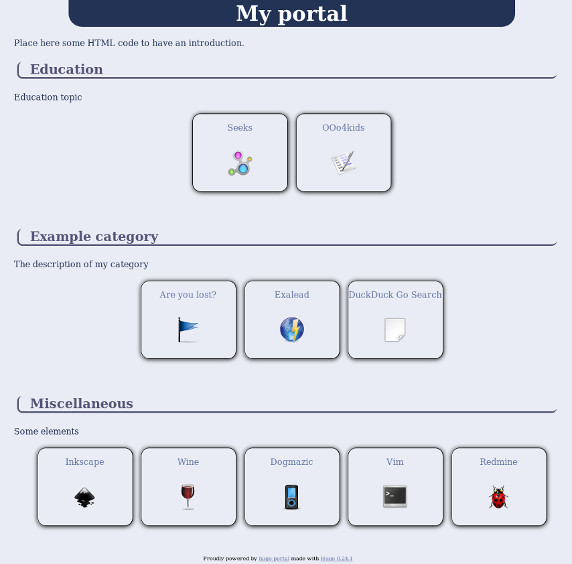

# Introduction


hugo-portal is a substitution of [PorteAil](https://github.com/blankoworld/porteail) by using [Hugo](http://gohugo.io/) as static website engine.

hugo-portal will creates a web portal as seen on screenshots section.

# Screenshots



# Requirements

You need to [get Hugo](http://gohugo.io/overview/quickstart/) and understand a little bit how it works.

# Installation

Either use the content of hugo-portal to set your own web portal, or just copy these directories to yours:

  * layouts
  * static

Then edit **config.toml** and adapt some elements:

  * languageCode: code used for page language. Use to display footer either in english or in french
  * title: will appears as a… title for your portal :)
  * style (in [params]): either **blue.css** or **black.css** which gives the portal main color

Remaining elements don't need to be changed.

# How it works

The web portal displays **buttons**. Each button is a kind of square.

Buttons are grouped by **apps** (which could be the equivalent for *a set of buttons*).

If you want to create a new set of buttons, add a new *apps* like that:

    hugo new apps/my_app.md

Which will create a new file in **content/apps/**.

Then edit it. And modify some things (have a look to next code to adjust):

  * title
  * add a description (in the content, after last ```+++```)
  * add some buttons (as a list)

```markdown
+++
date = "2016-01-20T18:31:21+01:00"
draft = false
title = "Miscellaneous"

+++
Some elements

  * 
  * 
  * 
  * 
```

# A button

When you add a button in the list, it should keep this form:

```markdown
  * 
```

You need so to:

  * add a title (Dogmazic)
  * complete the URL, in href tag (http://dogmazic.net)
  * [optional] add a name of a picture

Note 1: If you don't add the **src** tag, then a default picture will be used.

Note 2: if you enter *devices/multimedia-player.png* as source picture, then it expects the presence of this file: *static/img/devices/multimedia-player.png*. So all pictures should be placed in **static/img** directory.

# Introduction

You can change/complete the web portal introduction in **layouts/partials/introduction.html** file.

Pay attention to write HTML code (I don't find any other solution for that).
